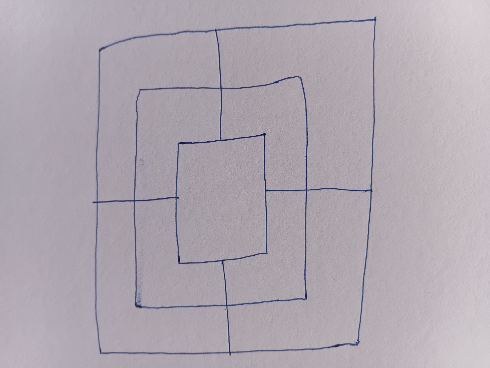
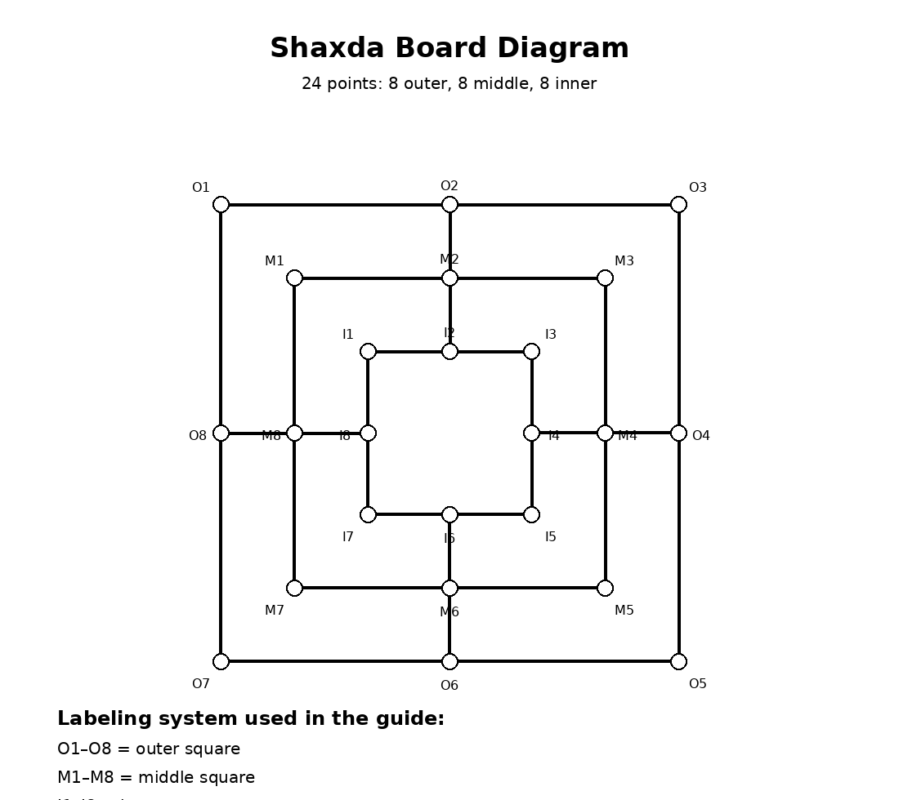
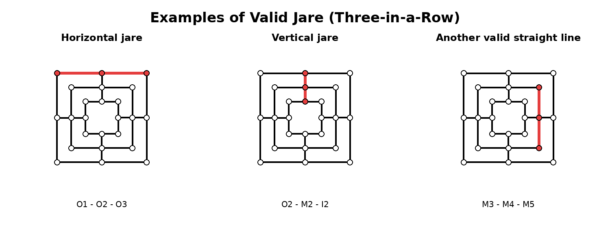
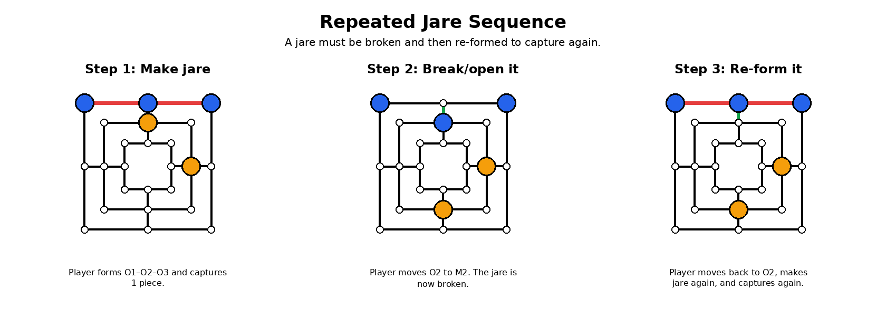
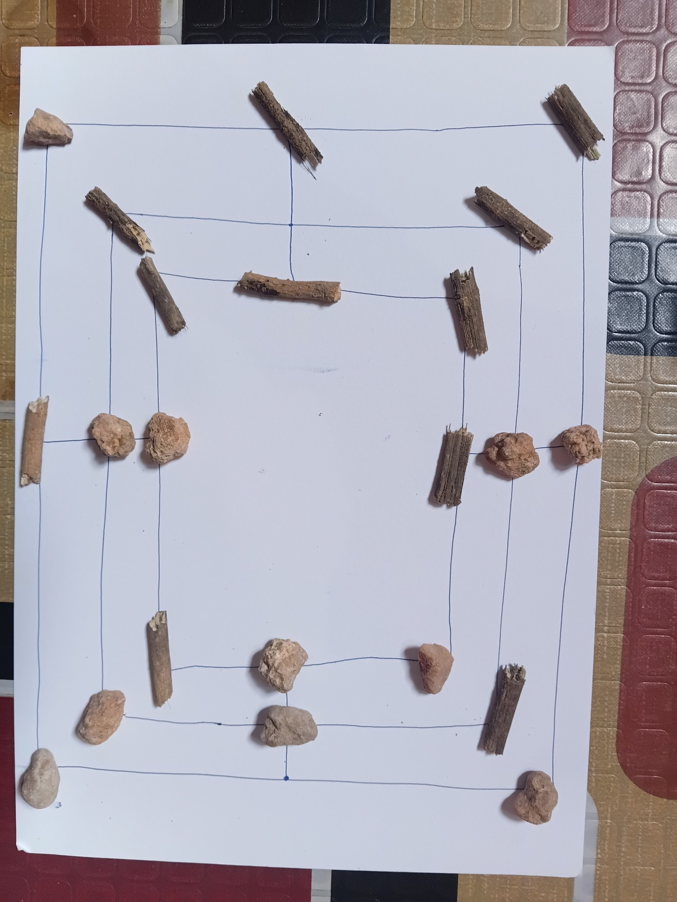

# Shaxda Game Guide

## 1. Purpose

This document is the concise source of truth for the Shaxda game itself: rules, board, terms, phases, movement, jare, repeated jare, irmaan, blocked-player handling, and win conditions.

---

## 2. What Is Shaxda?

**Shaxda** is a traditional Somali two-player strategy board game played on a board of **three connected squares** with **24 total points**.

Each player starts with **12 pieces**. Players first place all pieces, then each removes one opponent piece, then the game enters movement.

The main goal is to form a **jare**: three of your own pieces in a straight connected line. During movement, each newly formed jare allows one capture.

Shaxda is a game of planning, defense, attack, blocking, repeated tactical patterns, and advanced positions such as **irmaan**.

---

## 3. Game Materials

To play Shaxda, you need:

- 2 players;
- 1 Shaxda board;
- 24 total pieces:
  - 12 for Player A;
  - 12 for Player B.

The two sets of pieces must be clearly different. They can be stones, wood pieces, seeds, caps, colors, or any two clearly different small objects.

---

## 4. The Board

The board has **24 points** arranged on **three connected squares**:

- Outer square: 8 points;
- Middle square: 8 points;
- Inner square: 8 points.

Pieces are placed only on the points where lines meet or turn. Pieces are not placed in the spaces between lines.

A piece may move only along connected board lines.



---

## 5. Board Labeling System

For explanation, the board points are labeled:

### Outer Square

```txt
O1, O2, O3, O4, O5, O6, O7, O8
```

### Middle Square

```txt
M1, M2, M3, M4, M5, M6, M7, M8
```

### Inner Square

```txt
I1, I2, I3, I4, I5, I6, I7, I8
```

This labeling system is for teaching, diagrams, examples, and implementation. Players do not need labels during a normal physical game.



---

## 6. Important Terms

| Term        | Meaning                                                              |
| ----------- | -------------------------------------------------------------------- |
| **Shaxda**  | The name of the game.                                                |
| **Piece**   | A playing object used by a player.                                   |
| **Point**   | A valid location on the board where a piece can be placed or moved.  |
| **Move**    | Moving one own piece to the next connected empty point along a line. |
| **Jare**    | Three own pieces in a straight connected line; like three-in-a-row.  |
| **Irmaan**  | A repeated/protected jare that the opponent cannot block.            |
| **Remove**  | The initial removal after all 24 pieces are placed.                  |
| **Capture** | Removing one opponent piece after forming a jare during movement.    |

---

## 7. Objective

A player wins by defeating the opponent through captures and position.

A player wins when:

1. the opponent has fewer than **3 pieces** left;
2. all opponent pieces are captured;
3. or the opponent gives up.

A player needs at least **3 pieces** to form a jare, so a player with only **2 pieces** cannot continue effectively.

---

## 8. Game Structure

Shaxda has three main phases:

1. **Placement phase**
2. **Initial removal phase**
3. **Movement phase**

The game always follows this order.

---

## 9. Phase One: Placement

Before the game begins, players agree who places first.

Players then alternate placing one piece at a time until all **24 points** are filled.

Example if Player A starts:

1. Player A places one piece.
2. Player B places one piece.
3. Player A places another piece.
4. Player B places another piece.
5. This continues until all 24 pieces are placed.

During placement:

- players may form a **jare**;
- no pieces are removed yet;
- no captures happen;
- jare during placement only affects first advantage.

---

## 10. First Advantage Rule

The placement phase decides **first advantage**.

First advantage means:

1. the right to remove first after placement;
2. the right to move first after the initial removals.

How it is decided:

- the player who makes the **first jare during placement** gets first advantage;
- if no player makes a jare during placement, the **non-starting player** gets first advantage because they defended successfully.

Example if Player A starts:

- Player A makes the first jare → Player A gets first advantage.
- Player B makes the first jare before Player A → Player B gets first advantage.
- Nobody makes a jare → Player B gets first advantage.

Important: a jare during placement does **not** cause immediate removal. It only decides first advantage.

If one placement completes more than one jare line at the same time, it still counts as a single placement event. If first advantage has not already been decided, that player gets first advantage once. No pieces are removed during placement.

---

## 11. Phase Two: Initial Removal

After all 24 pieces are placed, each player removes **one opponent piece**.

This means:

- two pieces total are removed;
- each player loses one piece;
- each player now has 11 pieces on the board.

Order:

1. the player with first advantage removes first;
2. the other player removes second.

Removal choice:

- any opponent piece may be removed;
- a player may remove an ordinary piece;
- a player may remove a piece in a jare;
- a player may remove a defensive/protective piece;
- there are no restrictions on which opponent piece can be removed.

---

## 12. Phase Three: Movement

After initial removal, movement begins.

The player with first advantage moves first. Then turns alternate:

1. first-advantage player moves;
2. opponent moves;
3. first-advantage player moves again;
4. opponent moves again.

This continues until the game ends.

---

## 13. Legal Moves

A legal move means moving one own piece to the **next connected empty point** along a board line.

Rules:

- move only along a connected line;
- move only to the next connected point;
- destination must be empty;
- no jumping;
- no diagonal movement;
- cannot move through another piece;
- cannot move onto an occupied point.

Depending on position, a piece may have 1, 2, 3, or 4 possible directions.

---

## 14. Jare Rules

A **jare** is formed when a player has three own pieces in a straight connected line.

A jare may be horizontal, vertical, or any straight connected line of three points on the board.

During the **movement phase**, forming a jare allows the player to capture one opponent piece.

After capture, the turn ends and the opponent moves next.

Capture choice:

- the player may capture any one opponent piece;
- the captured piece may be ordinary;
- the captured piece may be part of an opponent jare;
- there are no capture restrictions.

If one movement completes more than one jare line at the same time, it still grants exactly one capture.

A movement-phase capture is allowed only when the move newly completes at least one jare line that was not complete before that move. A player cannot capture again from a jare that stayed unchanged.



---

## 15. All Valid Jare Lines

Using the board labels, the standard valid jare lines are:

### Outer Square

1. O1 - O2 - O3
2. O3 - O4 - O5
3. O5 - O6 - O7
4. O7 - O8 - O1

### Middle Square

5. M1 - M2 - M3
6. M3 - M4 - M5
7. M5 - M6 - M7
8. M7 - M8 - M1

### Inner Square

9. I1 - I2 - I3
10. I3 - I4 - I5
11. I5 - I6 - I7
12. I7 - I8 - I1

### Connector Lines

13. O2 - M2 - I2
14. O4 - M4 - I4
15. O6 - M6 - I6
16. O8 - M8 - I8

These are all straight connected lines of three points on the labeled board.

---

## 16. Repeated Jare

A player may make the same jare more than once, but the jare must be broken and re-formed.

A player cannot capture repeatedly from a jare that stays unchanged.

Correct repeated jare sequence:

1. player forms a jare;
2. player captures one opponent piece;
3. opponent moves;
4. player moves one piece away from the jare, breaking it;
5. opponent moves;
6. player moves the piece back and reforms the jare;
7. player captures again.

This is allowed.



---

## 17. Irmaan

**Irmaan** is a repeated or protected jare that the opponent cannot block.

Usually, irmaan happens when:

1. a player has a jare;
2. the player can move one piece away to open the jare;
3. later the player can move the piece back to reform the jare;
4. the opponent cannot move into the key empty point to stop it.

If the opponent can move into the key empty point and block the repeated jare, it is not true irmaan.

Irmaan is powerful because it can allow repeated captures. A player may give up when there is no realistic way to stop it.

---

## 18. Blocked Player Rule

A player may become blocked if they have no legal move.

Being blocked does **not** automatically lose the game.

Instead, the opponent must make a move that creates at least one legal movement space for the blocked player.

Restriction on the space-making move:

- it must create at least one legal move for the blocked player;
- it must **not** make a jare;
- it must only be used to give the blocked player a legal move.

If the blocked player is still unable to move, the opponent must continue making space until the blocked player has at least one legal move.

Blocking by itself does not win the game.

If both players are blocked, the game is a draw.

If the only possible space-making move would newly form a jare, the game is a draw instead. The space-making rule is only for reopening movement; it cannot be used to force a capture.

## 18.1 Draw and Termination Rules

A game can end in a draw when:

1. both players are blocked;
2. the required space-making move is impossible without newly forming a jare;
3. the same movement position occurs three times with the same player to move and no pending capture;
4. 80 consecutive movement turns complete without a capture.

The repeated-position rule uses board occupancy, current player, phase, and pending-capture status. Placement and initial-removal positions do not count toward repetition.

The no-capture clock starts when movement begins. A normal movement turn without a capture increments it. A capture resets it to zero.

Idle-but-connected online behavior is not a board-game draw rule. Online games should use a soft idle nudge, then allow the opponent to claim a win after the configured idle grace period in `docs/shaxda_prd.md`.

---

## 19. Winning the Game

A player wins when one of these happens:

1. the opponent has fewer than **3 pieces**;
2. all opponent pieces are captured;
3. the opponent gives up.

What does **not** automatically win:

- simply blocking the opponent.

---

## 20. Example Turn Flow

1. Player A and Player B agree who places first.
2. Players alternate placing pieces until all 24 points are full.
3. First advantage is decided:
   - first jare during placement wins first advantage;
   - if no jare forms, the non-starting player gets first advantage.
4. The first-advantage player removes one opponent piece.
5. The other player removes one opponent piece.
6. The first-advantage player makes the first movement-phase move.
7. Turns alternate.
8. During movement, a newly formed jare allows one capture.
9. Repeated jare is allowed only if opened and reformed.
10. If a player has irmaan, the opponent may give up if there is no realistic way to stop repeated captures.
11. The game ends when a win, draw, or resignation condition is met.

---

## 21. Diagram Guide

### Labeled Board

Shows the 24 board points and the point-label system.


### Valid Jare Examples

Shows examples of straight connected lines of three own pieces.


### Repeated Jare

Shows that a jare must be broken and re-formed before it can capture again.


### Real-Board Irmaan Example

Shows a position after:

- all 24 pieces were placed;
- both initial removals were made;
- each player had 11 pieces remaining.

The example shows an **irmaan** position for the wood-piece player: a repeated jare the opponent cannot effectively block.



---

## 22. Quick Rule Summary

### Setup

- 2 players.
- 12 pieces each.
- 24 board points total.
- Different pieces/colors for each player.

### Placement

- Players alternate placing pieces.
- No pieces are removed during placement.
- The first jare during placement decides first advantage.
- If no jare forms, the non-starting player gets first advantage.

### Initial Removal

- Each player removes one opponent piece.
- The first-advantage player removes first.
- Any opponent piece may be removed.
- After removal, each player has 11 pieces.

### Movement

- The first-advantage player moves first.
- A piece moves to the next connected empty point.
- No jumping.
- No diagonal movement.

### Jare

- Three own pieces in a straight connected line.
- A movement-phase jare allows one capture.
- After capture, the opponent moves next.

### Repeated Jare

- A jare must be broken and re-formed to capture again.
- A standing unchanged jare cannot capture repeatedly.

### Irmaan

- A repeated/protected jare the opponent cannot block.

### Blocked Player

- Blocking does not win the game.
- The opponent must make space for the blocked player.
- The space-making move cannot make a jare.
- Both-blocked and forced-jare space-making positions are draws.

### Draw

A game is drawn by both-blocked positions, forced-jare space-making positions, threefold movement repetition, or 80 movement turns without capture.

### Win

A player wins by:

- reducing the opponent to fewer than 3 pieces;
- capturing all opponent pieces;
- or the opponent giving up.

---

## 23. Beginner Notes

The easiest order to remember:

1. Place all pieces.
2. Decide first advantage through jare during placement.
3. Remove one piece each.
4. Move along lines.
5. Try to make jare.
6. Capture after movement-phase jare.
7. Break and remake jare to capture again.
8. Watch for irmaan.

Common beginner mistake:

- a player cannot keep capturing from a jare that remains unchanged;
- the jare must be opened and later closed again.

Defensive idea:

- if the opponent has a jare or possible repeated jare, it is often good to remove one of those pieces when you get a chance.

Irmaan warning:

- if a player can repeatedly remake a jare and the opponent cannot move into the key empty point, the position may become irmaan.

---

## 24. Future Improvements

A later polished version can include:

1. cleaner professional board diagram;
2. full map of all valid jare lines on one board;
3. dedicated legal-move diagram;
4. annotated irmaan diagram with arrows and blocked points;
5. one-page beginner quick-start sheet;
6. printable PDF edition;
7. website-friendly version;
8. mobile-app rules page.

---

## 25. File List

This guide references these image files:

- `shaxda_board_sketch.jpg`
- `shaxda_board_labeled.png`
- `shaxda_jare_examples.png`
- `shaxda_repeated_jare.png`
- `shaxda_irmaan_example.jpg`
